<p align="center">
  
</p>

<h1 align="center">🎨 EchoCanvas: Real-Time Speech-to-Image Generator</h1>
<p align="center">
  <i>Transform your voice into visuals — because imagination starts with words.</i><br>
</p>

<p align="center">
  
  
  
  
</p>

---

## 🧠 Overview

**EchoCanvas** is a **real-time Speech-to-Image Generation System** powered by **Deep Learning**.  
It listens to your voice, understands what you say, analyzes your sentiment, and brings your words to life as vivid AI-generated images — all within seconds.

Built with **Python** and **Streamlit**, the project integrates **OpenAI’s Whisper** for speech-to-text conversion, a **sentiment analysis model** for emotion detection, and **Stable Diffusion** for text-to-image generation.

---

## 🚀 Features

✅ **🎙️ Speech Recognition** – Record your voice in real-time using your microphone.  
✅ **🧾 Audio Transcription** – Converts speech into text using **Whisper**, a state-of-the-art speech recognition model.  
✅ **💬 Sentiment Analysis** – Understands the tone (Positive, Neutral, or Negative) of your spoken sentence.  
✅ **🖼️ AI Image Generation** – Uses **Stable Diffusion** to visualize your words into an image (for positive or neutral tones).  
✅ **⚡ Real-Time Interaction** – Generates results instantly through a simple and elegant **Streamlit web interface**.  
✅ **💾 Audio Saving & Replay** – Your audio is automatically saved as a `.wav` file for reuse or testing.  
✅ **🧩 Modular Design** – Whisper, sentiment analysis, and Stable Diffusion modules are decoupled for flexibility and easy upgrades.

---

## 🔁 System Workflow

### Step-by-Step Flow:
1. **Record Audio**  
   - User selects duration and records audio via microphone using `sounddevice`.  
   - Audio is saved as `recording.wav`.

2. **Speech-to-Text (Whisper)**  
   - The audio is transcribed using the **Whisper model** into human-readable text.

3. **Sentiment Detection**  
   - The transcription is analyzed by a **sentiment analysis model** to detect its tone: *Positive*, *Neutral*, or *Negative*.

4. **AI Image Generation (Stable Diffusion)**  
   - If the tone is *Positive* or *Neutral*, the text prompt is fed to **Stable Diffusion** to create a matching image.  
   - If *Negative*, the image generation is skipped, and the user is notified.

5. **Output Display**  
   - The **transcription**, **sentiment result**, and **generated image** (if any) are displayed together.

---

## 🧭 Flowchart

```mermaid
graph TD
    A[Start App] --> B[Set Recording Duration]
    B --> C[Record Audio 🎙️]
    C --> D[Save as recording.wav]
    D --> E[Transcribe using Whisper]
    E --> F[Analyze Sentiment]
    F -->|Positive/Neutral| G[Generate Image with Stable Diffusion]
    F -->|Negative| H[Skip Image Generation]
    G --> I[Display Text + Sentiment + Image]
    H --> J[Display Text + Sentiment Only]
    I --> K[End]
    J --> K[End]
```



---

## 🧩 Tech Stack

| Component | Technology Used |
|------------|------------------|
| **Frontend** | Streamlit |
| **Audio Recording** | sounddevice |
| **Speech-to-Text** | OpenAI Whisper |
| **Sentiment Analysis** | Hugging Face Transformers |
| **Image Generation** | Stable Diffusion (Diffusers library) |
| **Backend Language** | Python 3.10+ |
| **Environment** | Virtualenv or Conda |

---

## ⚙️ Installation

1. **Clone this repository:**
   ```bash
   git clone https://github.com/PavanKumar1207/Echo-Canvas
   cd EchoCanvas
   ```

2. **Create and activate a virtual environment:**
   ```bash
   python -m venv venv
   venv\Scripts\activate     # On Windows
   source venv/bin/activate  # On macOS/Linux
   ```

3. **Install dependencies:**
   ```bash
   pip install -r requirements.txt
   ```

4. **(Optional) Download pre-trained models:**
   - Whisper model: [OpenAI Whisper](https://github.com/openai/whisper)
   - Stable Diffusion: [Hugging Face Diffusers](https://huggingface.co/CompVis/stable-diffusion-v1-4)

---

## ▶️ How to Run

Start the Streamlit app:
```bash
streamlit run speech_to_image.py
```

Then open the **localhost URL** (usually `http://localhost:8501`) in your browser.

### 🧭 Usage Steps
1. Set your **recording duration**.  
2. Click **🎙️ Start Recording**.  
3. Wait for transcription and sentiment analysis to complete.  
4. If the sentiment is *positive* or *neutral*, an AI-generated image will appear.  
5. Download or view the output image.

---

## 📁 Project Structure

```
EchoCanvas/
│
├── speech_to_image.py        # Main Streamlit app
├── requirements.txt          # All dependencies
├── assets/                   # Optional: images, icons, etc.
├── recordings/               # Saved audio files
├── outputs/                  # Generated AI images
├── README.md                 # Documentation
└── LICENSE                   # MIT License
```

---

## 🧠 Future Enhancements

- 🎭 **Emotion-based Style Generation:** Modify image style based on detected emotion (e.g., dark for sad, bright for happy).  
- 🗣️ **Multi-Language Whisper Support:** Extend to other languages like Hindi, Spanish, etc.  
- 📡 **Live Stream Support:** Convert live audio streams (e.g., speeches) into visual stories in real-time.  
- 🤖 **Chatbot Integration:** Combine with conversational AI to generate interactive storytelling.  
- 🪄 **Fine-tuned Diffusion Model:** Use custom fine-tuned Stable Diffusion models for domain-specific visuals.

---

## 🧰 Troubleshooting

| Issue | Possible Fix |
|--------|---------------|
| **CUDA not available** | Install PyTorch with CUDA or fallback to CPU (slower). |
| **Model not loading** | Check model paths and ensure proper Hugging Face authentication. |
| **Audio not recorded** | Verify microphone permissions and device index. |
| **Memory Errors** | Use smaller model versions or enable CPU inference. |

---

## 🤝 Contributing

Contributions are always welcome!  

1. Fork this repo  
2. Create your feature branch (`git checkout -b feature/amazing-feature`)  
3. Commit your changes (`git commit -m 'Add some feature'`)  
4. Push to the branch (`git push origin feature/amazing-feature`)  
5. Open a **Pull Request**

---

## 📜 License

This project is licensed under the **MIT License** — see the [LICENSE](LICENSE) file for details.

---

## 🌟 Acknowledgements

- [OpenAI Whisper](https://github.com/openai/whisper)
- [Hugging Face Transformers](https://huggingface.co)
- [Stable Diffusion](https://stability.ai/)
- [Streamlit](https://streamlit.io)
- [Diffusers](https://github.com/huggingface/diffusers)

---

## 💡 Example Output

| Input (Speech) | Sentiment | Generated Image |
|----------------|------------|-----------------|
| “A sunset over a calm ocean.” | Positive | 🌅 *(AI-generated ocean sunset)* |
| “A person walking through a forest in the rain.” | Neutral | 🌧️ *(AI-generated forest scene)* |
| “I feel so sad and lost.” | Negative | 🚫 *(No image generated)* |

---
## 🤩 Support & Stars

<p align="center"> If you find this project interesting, please give it a ⭐ and share it with others! </p> <p align="center">  </p>

---

## 🏁 End of README  
`“Where words meet imagination — EchoCanvas turns sound into art.”`
